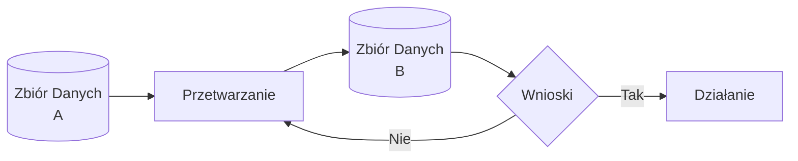
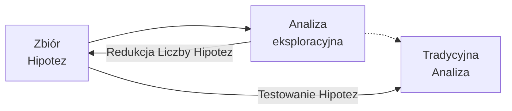

###

## Na początek odrobina historii
### Ach, gdyby nie te komputry...

Jeżeli choć odrobinę interesujecie się programowaniem i tematami pokrewnymi, a ostatnich 10 lat nie spędziliście na przeciągającym się Erasmusie wśród Amiszów, to nie ma opcji, abyście nie spotkali się do tej pory z terminem *Data Science*. Jeżeli jednak jakimś cudem ominęły Was ostatnie lata i powróciliście ostatnimi dniami z umysłowych zaświatów, to pozwólcie, że opowiem Wam krótką bajeczkę.

Wcale nie tak dawno, bo w 1962 roku, i wcale nie tak daleko, bo na kampusie Uniwersytetu w Princeton, pomieszkiwał sobie za kasę amerykańskich podatników pewien jegomość, [John Tukey](https://en.wikipedia.org/wiki/John_Tukey). Był to osobnik o szczególnej aparycji i równie wyróżniających się umiejętnościach we władaniu matematyką i statystyką, przez co żyło mu się nad wyraz łatwo i przyjemnie w porównaniu do reszty plebejuszy. Osobnik wyróżniał się jak na swoje czasy nie tylko umiejętnościami ścisłymi, ale również humanistycznymi, bo parał się, dość biegle zresztą, jasnowidztwem. Przewidział mianowicie, że w bliskiej przyszłości komputery znajdą swoje zastosowanie w rozwiązywaniu problemów statystycznych tak, jak do tej pory służyły w rozwiązywaniu problemów matematycznych. Ostatecznie, wieszczył, nastąpi połączenie metod matematycznych, metod statystycznych oraz metod komputerowych w ramach swoistej trójcy świeckiej służącej na rzecz analizy danych (ang. _Data Analysis_ — co ciekawe, to najprawdopodobniej Tukey w swoim artykule z 1962 roku jako pierwszy zaproponował i wykuł termin analizy danych, jako nowej dziedziny, w której wykorzystuje się połączenie matematyki, statystyki oraz technik komputerowych) [1].
 
Koniec bajeczki. Tukey będący, co tu ukrywać, statystykiem wybitnym (wymyślił np. wykresy skrzynkowe i algorytm szybkiej transformaty Fouriera), wyczuwał w powietrzu pewnego rodzaju zmianę dotychczasowego paradygmatu. Komputery stawały się coraz powszechniejsze, więc problemy matematyczne nie musiały już być rozwiązywane ręcznie na kartkach papieru. Rosły wolumeny danych generowanych i zbieranych przez różnorakie podmioty (firmy, uniwersytety, placówki naukowe i rządowe). Stawało się oczywistym, że grzechem byłoby niewykorzystanie potencjału drzemiącego w automatyzacji i wydajności obliczeń komputerowych na rzecz przetwarzania i analizowania danych i wyciągania na ich podstawie cennych wniosków. Po co? Nie było i wciąż nie ma na to jednej odpowiedzi. Naukowcy chcieliby _pchnąć zrozumienie Wszechświata naprzód_. Decydenci chcieliby _zrozumieć lepiej działania adwersarzy oraz swoich politycznych rywali_. Firmy chciałyby _zarobić więcej pieniążków_ itd.

Żadna rewolucja jednak nie nadeszła. Po prostu powoli, sukcesywnie, pracowano równolegle przez lata nad wieloma dziedzinami naraz. Rozwijały się komputery i języki programowania. Rozwijały się metody matematyczne i statystyczne. Rozwijały się metody zbierania i przechowywania danych. To wszystko spotykało się gdzieś po drodze w nauce, sektorze prywatnym i rządowym.

Latka sobie mijały, aż w 1974 Peter Naur opublikował książkę "Concise Survey of Computer Methods" [2], w której przedstawił definicję przetwarzania danych pozostającą aktualną do dzisiaj.

> The essence of data processing is that the data corresponding to some meaning is combined with the process corresponding to some intent to form new, so far unknown data. [...] ultimate guide in designing a data process is that it should reduce the incoming data to a form which may directly initiate people's action through its corresponding meaning. Where a data process does not clearly satisfy this requirement, it must either be one out of a chain of processes which at least potentially will lead to actions in human beings, or it is simply a dead end which deserves only to be eliminated, the sooner, the better.
> 
>-- 1.7 Data Processing, p. 27.

Za każdym razem, gdy czytam te słowa, uderza mnie prostota opisu procesu przetwarzania danych i intuicyjność w jego zrozumieniu. Przetwarzanie danych bowiem to proces, w którym przetwarzamy zbiór danych A na zbiór danych B i liczymy na to, że zbiór B zapewni nam nowe informacje względem zbioru A (wnioski), dzięki czemu będziemy mogli podjąć jakieś bliżej nieokreślone działanie. Ot, i cała filozofia.

Wspomniane "działanie" może dotyczyć niemalże każdej dziedziny, jaką jesteśmy sobie w stanie wyobrazić: naukową, biznesową, militarną, polityczną - _you name it_.

Nie jestem pewien, ale wydaje mi się, że książka Petera może być pierwszą lub jedną z pierwszych pozycji, w których pojawia się termin _Data Science_, który jest rozumiany jako, dosłownie, nauka o danych — czyli wszystko to, co związane jest z ich zbieraniem, przechowywaniem, przetwarzaniem, analizą i modelowaniem, ALE z wykorzystaniem komputerów.

> A basic principle of data science, perhaps the most fundamental that may be formulated, can be stated:
> 
> _The data representation must be chosen with due regard to the transformation to be achieved and the data processing tools available._
> 
> Three remarks are relevant: (1) Since data science is concerned with methods of construction of data processes, it is consistent that its basic principles come as design guidance. (2) The principle is consistent with the idea of the freedom to choose the data representation. (3) The regard to the data processing tools is consistent with the notion that basically data are things to be processed.
> 
> [...] The principle does not impose any particular criteria on the choice. Such criteria must be added as desired in any particular situation. Among the criteria which may thus be imposed on the choice are:
> 
> - speed of processing
> - conceptual simplicity of the data process
> - flexibility with respect to change of the data process
> - low total cost of the use of the data process, according to some given cost function
> 
> -- 1.8 A Basic Principle of Data Science, p. 28.

Niemniej, tuptając ku teraźniejszości po wydarzeniach z przeszłości, w 1977 powstało _The International Association for Statistical Computing_, czyli ówczesny autorytet (bodaj pierwszy?) w _Data Science_, który za swoją główną misję przyjął związanie metod statystycznych, nowoczesnych technologii komputerowych oraz wiedzy eksperckiej z różnych dziedzin celem przekształcania zestawów danych w wartościowe informacje i wiedzę.

> [...] to link traditional statistical methodology, modern computer technology, and the knowledge of domain experts in order to convert data into information and knowledge.

Po drodze w tym samym roku Tukey opublikował naprawdę "grubą" książkę — w sensie, że dobrą, bo przecież 700 stron łyka się w jeden wieczór, no nie? W książce tej przekonywał o konieczności połączenia eksploracyjnej analizy danych oraz tradycyjnej analizy danych, co w rezultacie pozwoliłoby na redukcję hipotez, które chcemy przetestować w ramach tradycyjnej analizy danych na posiadanym zestawie danych [3].

### Grzebanie w danych = pieniążki

I znowu latka sobie mijały, technologie się rozwijały, a wszyscy co raz więcej danych zbierali. W 1994 Jonathan Berry w artykule opublikowanym w Business Week Bloomberga pisał:

> First came the mass market, that vast, undifferentiated body of consumers who received identical, mass-produced products and messages--any color of car they wanted, so long as it was black. Then came market segmentation, which divided still-anonymous consumers into smaller groups with common demographic or psychographic characteristics. Now, new generations of faster, more powerful computers are enabling marketers to zero in on ever-smaller niches of the population, ultimately aiming for the smallest consumer segment of all: the individual.
> 
> A growing number of marketers are investing millions of dollars to build databases that enable them to figure out who their customers are and what it takes to secure their loyalty [4].

No i zaczęło się... Może ujmę to inaczej. Wiem, że od zawsze wykorzystywano wszelkie możliwe narzędzia do zwiększania profitów w dziedzinach wszelakich i tak też musiało stać się w kontekście metod komputerowej analizy danych. Jednak dopiero na przełomie XX oraz XXI wieku wszystkie elementy układanki zaczęły do siebie pasować na tyle, że w końcu analiza danych mogła opuścić zadymiony pokój smutnych inżynierów i biednych naukowców i rozepchać się porządnie na salonach, na których zaczęto oczekiwać, że przyniesie im miliardy dodatkowych zysków. Nadeszły bowiem czasy, gdy istniały już metody i technologie umożliwiające efektywne przetwarzanie danych, których przedsiębiorstwa posiadały już zatrzęsienie. 

Dla przykładu, w 1992 _General Motors_ (GM), łącząc swoje siły z _Master Cards_, uzyskało dostęp do bazy danych 12 milionów właścicieli kart. Dzięki tym danym GM wiedziało, czym jeżdżą ich właściciele, kiedy planują kupno następnego auta oraz jakiego rodzaju auta preferują. Dzięki temu, gdy klient wyrażał zainteresowanie kupnem nowego samochodu, dedykowany system wysyłał zindywidualizowane informacje dla potencjalnego klienta na temat samochodu, który zdaniem systemu będzie do niego pasował idealnie. Nie muszę chyba pisać, że przyczyniło się to do wzrostu dochodów GM (w sposób dość znaczny).

GM nie było w tym nowym wyścigu szczurów jednak osamotnione. Nie, nie. Blockbuster Entertainment Corp. (słynna, amerykańska firma specjalizująca się w wypożyczaniu kaset VHS, którą wygryzł Netflix) korzystało w 1994 roku z bazy danych 36 milionów gospodarstw domowych i 2 miliony dziennych transakcji, pomagając swoim klientom w wyborze odpowiedniego dla nich filmu oraz kierując ich do najbliższych wypożyczalni firmy. Przykłady wykorzystania gargantuicznych jak na tamte czasy zestawów danych do zwiększania zysku firm można by mnożyć.

W każdym razie powoli stawało się jasne, że `dane = pieniążki`, więc kto tylko mógł, to gromadził je na potęgę i handlował danymi z kim i gdzie się tylko dało. Istniały jednak wciąż problemy, które należało rozwiązać. Jacob Zahavi zwrócił uwagę w 1999 roku [5], że potrzeba powstania nowych metod i narzędzi, które mogłyby pomóc w efektywnym przetwarzaniu wielkich wolumenów danych, jest kluczowa z uwagi na niską skalowalność obecnie istniejących rozwiązań oraz przyrastającą wykładniczo ilość zbieranych danych:

> Scalability is a huge issue in data mining… Conventional statistical methods work well with small data sets. Today’s databases, however, can involve millions of rows and scores of columns of data… Another technical challenge is developing models that can do a better job analyzing data, detecting non-linear relationships and interaction between elements… Special data mining tools may have to be developed to address web-site decisions.

Zaczęto też coraz częściej korzystać z nowego określenia _Data Mining_, nazywając w ten sposób połączenie eksploracyjnej i tradycyjnej analizy wielkich zestawów danych stawiających sobie za cel "wydobywanie" (stąd _mining_) wniosków oraz informacji, które mogą zostać wykorzystane w zwiększeniu zysków firmy posiadającej te dane. Niemniej, słowa Jacoba nabrały szczególnego znaczenia w 2001 roku, kiedy to światło dzienne ujrzała koncepcja _Service-as-a-Service_, czyli aplikacji, jako usługi, kładąc podwaliny dla takich dzisiejszych molochów, jak _Google_, _Facebook_, czy _Microsoft_.

### No i świat oszalał...

...dosłownie. 

* Rok 2002 - Powołanie do życia pierwszego czasopisma naukowego dedykowanego _Data Science_ przez _Committee on Data Science and Technology_ o nazwie [_Data Science Journal_](https://datascience.codata.org/).
* Rok 2008 - Termin _Data Scientist_ staje się _viralem_.
* Wielkie korporacje, jak _Google_, czy _Facebook_ zaczynają opierać swoje istnienie na pośredniczeniu między reklamodawcami a swoimi użytkownikami. Przetwarzanie wielkich wolumenów danych, ich analiza i budowanie modeli predykcyjnych staje się nieodłączną częścią działalności korporacji.
* Rok 2010 - Powstaje platforma [Kaggle](https://www.kaggle.com/), zrzeszająca osoby zajmujące się _Data Science_. 
* Rozkręca się _hype_ na sztuczną inteligencję. 
* Rok 2011 - Liczba ofert pracy dla _Data Scientist'ów_ skacze o 15 000%.
* Sztuczna inteligencja stworzona przez IBM wygrywa program Jeopardy!
* Rok 2012 - _Data Scientist_ zostaje okrzyknięte najseksowniejszym stanowiskiem pracy na świecie przez Harvard [6]. 
* Rok 2013 - Według _IBM_ 90% wszystkich danych na świecie zostało wytworzonych w ciągu ostatnich dwóch lat.
* Rok 2014 - _Data Scientist_ zostaje okrzyknięte najseksowniejszym stanowiskiem pracy na świecie przez magazyn _Forbes_ [7]. 
* Rok 2015 - Dzięki wykorzystaniu uczenia głębokiego (jednej z form uczenia maszynowego) efektywność systemu rozpoznawania mowy firmy Google skacze o 49%. Google zwiększyło również wykorzystanie uczenia maszynowego z dotychczasowego sporadycznego, do ponad 2 700 wewnętrznych projektów.
* Rok 2016 - Sztuczna inteligencja o nazwie _AlphaGo_ stworzona przez firmę Deep Mind należącą do firmy _Google_ pokonuje mistrza świata w grze Go.
* Rok 2021 - sztuczna inteligencja o nazwie _AlphaFold_ przewiduje struktury białek nieporównywalnie efektywniej niż dotychczasowe metody komputerowe nadzorowane przez człowieka.
* Rok 2022 - Jason Allen wykorzystując obrazy wygenerowane przez sztuczną inteligencję _Midjourney_, wygrywa konkurs artystyczny, pokonując artystów tworzących swoje prace ręcznie [8].

_Zwycięska praca Jasona Allena, która została wygenerowana przez sztuczną inteligencję. Co ciekawe, możecie bez problemu "pobawić" się tym cudem, wchodząc na jej [stronę](https://www.midjourney.com/home/)._

### Zatrzymajmy się i ochłońmy

To prawda, świat oszalał na punkcie danych i ich przetwarzania. Świat oszalał na punkcie modelowania rzeczywistości na podstawie danych z wykorzystaniem modeli uczenia maszynowego, które często chcemy nazywać sztucznymi inteligencjami, które jednak stety/niestety z inteligencjami wiele wspólnego nie mają. Świat oszalał na punkcie analizy danych i potencjału, jaki w tym drzemie. Odpowiednio przetworzone dane są bowiem w stanie zapewnić informację, która jest tym, czym było kiedyś złoto — cennym kruszcem na miarę XXI wieku. Osobiście postrzegam obecny _boom_ na przetwarzanie danych, które nie wiedzieć kiedy rozrosło się do rozwiązań nazywanych sztucznymi inteligencjami, jako kolejną rewolucję społeczno-technologiczną. Jest to rewolucja na miarę rewolucji internetowej, która odmienia i będzie odmieniać nasze życie w sposób jeszcze do końca nieprzewidywalny.

Świat zbierania, przechowywania, przetwarzania, analizy i modelowania danych, choć wyjątkowo dynamicznie się rozwijający, to zdążył już delikatnie "ochłonąć" dzięki czemu większość z nas nie będzie miała obecnie problemu z odnalezieniem się w jego meandrach. Dla przykładu dość wyraźnie zarysowały się trzy główne gałęzie związane ze światem danych (które oczywiście "po złośliwości" moglibyśmy i tak dzielić w nieskończoność). Dotychczasowe, samotne _Data Science_ i gdzieś tam wałęsające się po kątach _Data Mining_ możemy dzisiaj podzielić na:

- _Data Engineering_ — Więcej zarządzania danymi.
- _Data Analysis_ — Więcej wnioskowania na podstawie danych.
- _Data Science_ — Więcej prognozowania na podstawie danych.

Oczywiście należy zdawać sobie sprawę z daleko posuniętego uproszczenia przy tworzeniu podziału tego rodzaju i możliwości przeplatania się obowiązków danetyków zajmujących się _Data Engineering_, _Analysis_ oraz _Science_ nawet w ramach jednej firmy. Nie należy jednak obrażać się na taki stan rzecz głównie z uwagi na ciągle rozwijającą się dziedzinę pracy z danymi. Tukey pisząc w 1962 roku o praktycznym zastosowaniu matematyki i statystyki w analizie danych przekonywał, że statystyka to tak naprawdę matematyka i że należy postawić wyraźną granicę między statystyką a analizą danych. Naur pisząc w 1974 roku o _Data Science_ uważał, że termin ten powinien zastąpić termin [_Computer Science_](https://en.wikipedia.org/wiki/Computer_science) (taki odpowiednik polskiej informatyki, ale obejmujący więcej tematów), a samo _Data Science_, to nie analiza danych, ale raczej nauka o metodach analizy danych. Dzisiaj natomiast _Data Engineer_ ogarnia infrastruktury bazodanowe i przetwarza dane, _Data Analyst_ przetwarza dane i je analizuje, a _Data Scientist_ analizuje dane i je modeluje. A w zależności od firmy pewnie spotkamy czasem totalne odwrócenie ról, nazw stanowisk i wykorzystywanych technologii. Zmierzam do tego, aby nie przywiązywać wagi do terminów (bo te wciąż ewoluują), ale do tego, co chcemy z danymi robić — zbierać, przechowywać, przetwarzać, analizować, modelować? Niech aktualnie przyjęte etykiety opisujące zbiory wymienionych procesów będą ostatnią rzeczą, o której będziecie myśleć.

## Czym jest danetyka?

Żałuję odrobinę, że temat tego artykułu jest, jaki jest, i że nie mogę widzieć Waszych twarzy, gdy zastanawiacie się, jak można by przetłumaczyć to "cholerne" _Data Science_ oraz _Data Scientist_ na język polski. O ile z tym pierwszym terminem jeszcze można sobie poradzić z wykorzystaniem wybitnie mdłego wyrażenia "nauka o danych", tak w przypadku tego drugiego sytuacja wygląda gorzej, niż beznadziejnie. Naukowiec danych? Naukowiec zajmujący się danymi? No na litość... 

Przyznam w tym miejscu, że długo się zastanawiałem co z tym "fantem" zrobić i nie byłem w stanie wymyślić żadnego sensownego rozwiązania. Jednak, gdy tak sobie wesoło prokrastynowałem i przy okazji myślałem, uderzyła mnie oczywistość rozwiązania, które cały czas miałem przed oczami. Przecież informatyka to nauka zajmująca się przetwarzaniem informacji. Jak więc mogłaby się nazywać nauka o przetwarzaniu danych? Dane-tyka. Danetyka! :) Chciałbym w tym miejscu jednak oddać sprawiedliwość sprawie i przyznam szczerze, że najwyraźniej nie jestem pierwszą osobą, która na to wpadła, bo znalazłem artykuł, wg. którego już w 2019 roku propozycja tego terminu padła od prof. Przemysława Grzegorzewskiego z Politechniki Warszawskiej, o czym można przeczytać w artykule na stronie [kodolamacz.pl](https://www.kodolamacz.pl/blog/data-science-po-polsku/). Czego w tym miejscu chciałbym Panu Profesorowi pogratulować, bo w mojej ocenie termin wyjątkowo trafnie nie tylko opisuje dziedzinę w formie, w jakiej istnieje obecnie, ale może pomieścić o wiele więcej tematyki związanej z danymi w przyszłości. Dodatkowo zyskaliśmy nie tylko genialną nazwę dla nowej dziedziny, nauce o danych, ale również nazwę wykształcenia kierunkowego, tj. danetyk/danetyczka. Zgadzam się jednak całkowicie z Norbertem Ryciakiem z kodolamacza, że raczej nie zobaczymy stanowiska pracy o nazwie "danetyk" podobnie, jak raczej nie widujemy w ofertach pracy zbyt często stanowisk o nazwie "informatyk". Chociaż... kto wie? :)

Danetyka, czyli od ang. _Data Science_, to wciąż młoda, lecz dynamicznie rozwijająca się dziedzina nauki o danych, czyli ich zbieraniu, przechowywaniu, przetwarzaniu, analizowaniu oraz modelowaniu. Celem tych procesów jest natomiast stworzenie nowej informacji, która może zainicjować nowe działanie (np. człowieka).

## Referencje
1. Tukey JW (1962) "The Future of Data Analysis". The Annals of Mathematical Statistics. [Przejdź do źródła](https://projecteuclid.org/journals/annals-of-mathematical-statistics/volume-33/issue-1/The-Future-of-Data-Analysis/10.1214/aoms/1177704711.full).
2. Peter Naur (1974) "Concise Survey of Computer Methods".
3. Tukey JW (1977) "Exploratory Data Analysis". Addison-Wesley. [Przejdź do źródła](http://www.ru.ac.bd/wp-content/uploads/sites/25/2019/03/102_05_01_Tukey-Exploratory-Data-Analysis-1977.pdf).
4. Berry J (1994) "Database Marketing". Business Week. [Przejdź do źródła](https://www.bloomberg.com/news/articles/1994-09-04/database-marketing?leadSource=uverify%20wall#xj4y7vzkg).
5. Zahavi J (1999) "Mining Data for Nuggets of Knowledge". [Przejdź do źródła](https://knowledge.wharton.upenn.edu/article/mining-data-for-nuggets-of-knowledge/). 
6. Davenport TH & Patil DJ (2012) "Data Scientist: The Sexiest Job of the 21st Century". Harvard Business Review. [Przejdź do źródła](https://hbr.org/2012/10/data-scientist-the-sexiest-job-of-the-21st-century). 
7. Magyar J (2014) "Data Scientist: Sexiest Job Of The Century?". Forbes. [Przejdź do źródła](https://www.forbes.com/sites/sap/2014/01/21/data-scientist-sexiest-job-of-the-century/?sh=1edf3248674b).
8. Harwell D (2022) "He used AI to win a fine-arts competition. Was it cheating?" Washington Post. [Przejdź do źródła](https://www.washingtonpost.com/technology/2022/09/02/midjourney-artificial-intelligence-state-fair-colorado/).